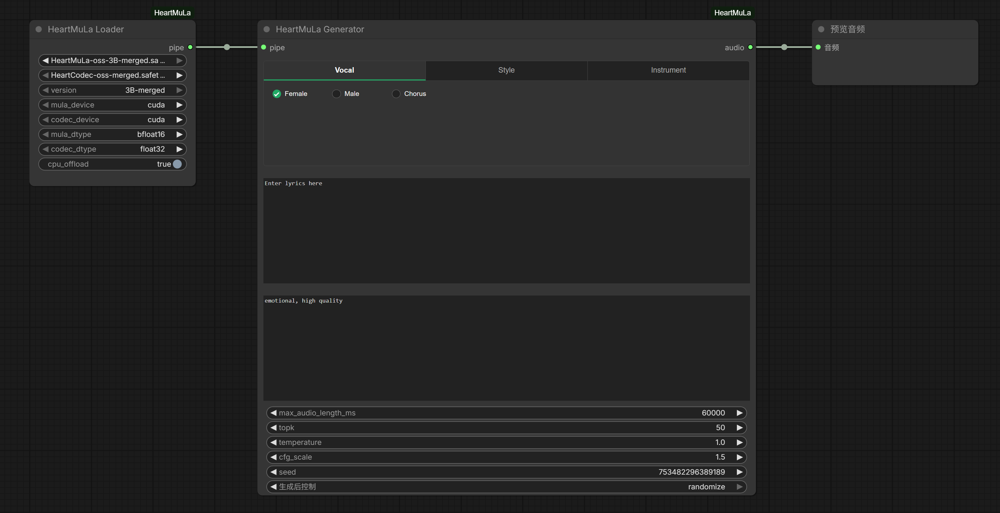

# HeartMuLa ComfyUI Custom Node

[中文](#中文指南) | [English](#english-guide)

<a id="中文指南"></a>

## HeartMuLa ComfyUI 自定义节点

本项目提供用于运行 HeartMuLa-oss-3B 音乐生成模型的 ComfyUI 节点。
它是自包含的，内置了 `heartlib` 核心库，无需额外配置环境路径。

### 工作流示例



👉 **[下载工作流文件 (HeartMuLa-oss-gen-example.json)](https://github.com/crazyma99/ComfyUI-HeartMuLa/blob/master/HeartMuLa-oss-gen-example.json)**


### 安装

1.  将 `ComfyUI-HeartMuLa` 文件夹复制到您的 `ComfyUI/custom_nodes/` 目录中。
    *   文件夹结构应为 `ComfyUI/custom_nodes/ComfyUI-HeartMuLa/`。
2.  安装依赖：
    ```bash
    # 在 ComfyUI-HeartMuLa 目录下运行
    pip install -r requirements.txt
    ```

### 模型设置

👉 **[下载模型 (ModelScope)](https://modelscope.cn/models/AIGCCrazyMa/HeartMuLa-oss_ComfyUI/)**

1.  下载 `HeartMuLa-oss-3B-merged.safetensors` 并放入 `ComfyUI/models/checkpoints/`。
2.  下载 `HeartCodec-oss-merged.safetensors` 并放入 `ComfyUI/models/checkpoints/`。

### 使用方法

本自定义节点套件遵循 3 步工作流：

1.  **HeartMuLa Loader (加载器)**：加载模型。
    *   **mula_model**：选择 HeartMuLa 主模型（生成模型）。
    *   **codec_model**：选择 HeartCodec 编解码模型。
    *   **cpu_offload**：启用以节省显存（推荐消费级显卡使用）。
2.  **HeartMuLa Generator (生成器)**：根据文本生成音频。
    *   **Preset UI**: 节点内置了可视化的预设选择界面，支持选择 Vocal（人声性别）、Style（风格）、Instrument（乐器）。
    *   **Vocal**: 支持 Female, Male, Chorus。
    *   **Style/Instrument**: 支持多选。
    *   **lyrics**: 在此输入歌词。
    *   **tags**: 输入风格标签（例如 "pop, female vocal"）。
    *   **max_audio_length_ms**: 时长（毫秒）。
3.  **HeartMuLa Preview/Save (预览/保存)**：播放并保存生成的音频。

> 💡 **提示**：您可以在本仓库中找到示例工作流文件 `HeartMuLa-oss-gen-example.json`，直接拖入 ComfyUI 即可使用。

### 节点说明

#### HeartMuLa Loader
*   **输入**：Mula Model, Codec Model, Version, Device settings, CPU Offload。
*   **输出**：`HEARTMULA_PIPE` (模型管道)。

#### HeartMuLa Generator
*   **输入**：管道，歌词，标签，生成参数（Temperature, TopK, CFG Scale）。
    *   **Preset UI**: 节点内置了可视化的预设选择界面，支持选择 Vocal（人声性别）、Style（风格）、Instrument（乐器）。
    *   **Vocal**: 支持 Female, Male, Chorus。
    *   **Style/Instrument**: 支持多选。
*   **输出**：`AUDIO` (标准 ComfyUI 音频格式)。

#### HeartMuLa Preview/Save
*   **输入**：音频。
*   **输出**：保存 .wav 文件到输出目录并显示播放器组件。

### 依赖要求

*   ComfyUI
*   Python >= 3.9
*   Python 包依赖见 `requirements.txt`。

---

<a id="english-guide"></a>

## English Guide

This project provides ComfyUI nodes for running the HeartMuLa-oss-3B music generation model.
It is self-contained and includes the `heartlib` core library.

### Workflow Example


👉 **[Download Workflow File (HeartMuLa-oss-gen-example.json)](https://github.com/crazyma99/ComfyUI-HeartMuLa/blob/master/HeartMuLa-oss-gen-example.json)**

### Installation

1.  Copy the `ComfyUI-HeartMuLa` folder into your `ComfyUI/custom_nodes/` directory.
    *   The folder structure should look like `ComfyUI/custom_nodes/ComfyUI-HeartMuLa/`.
2.  Install dependencies:
    ```bash
    # Inside ComfyUI-HeartMuLa directory
    pip install -r requirements.txt
    ```

### Model Setup

👉 **[Download Models (ModelScope)](https://modelscope.cn/models/AIGCCrazyMa/HeartMuLa-oss_ComfyUI/)**

1.  Download `HeartMuLa-oss-3B-merged.safetensors` and place into `ComfyUI/models/checkpoints/`.
2.  Download `HeartCodec-oss-merged.safetensors` and place into `ComfyUI/models/checkpoints/`.


### Usage

This custom node suite follows a 3-step workflow:

1.  **HeartMuLa Loader**: Loads the models.
    *   **mula_model**: Select the HeartMuLa main model.
    *   **codec_model**: Select the HeartCodec model.
    *   **cpu_offload**: Enable to save VRAM (Recommended for consumer GPUs).
2.  **HeartMuLa Generator**: Generates audio from text.
    *   **Preset UI**: Built-in visual preset selector for Vocal, Style, and Instrument.
    *   **lyrics**: Enter lyrics here.
    *   **tags**: Enter additional style tags.
    *   **max_audio_length_ms**: Duration in milliseconds.
3.  **HeartMuLa Preview/Save**: Plays and saves the generated audio.

> 💡 **Tip**: You can find an example workflow file `HeartMuLa-oss-gen-example.json` in this repository. Simply drag and drop it into ComfyUI to get started.

### Nodes

#### HeartMuLa Loader
*   **Inputs**: Checkpoint name, device settings, CPU offload.
*   **Outputs**: `HEARTMULA_PIPE` (Model Pipeline).

#### HeartMuLa Generator
*   **Inputs**: Pipeline, Lyrics, Tags, Generation Parameters (Temperature, TopK, CFG Scale).
*   **Outputs**: `AUDIO` (Standard ComfyUI Audio format).

#### HeartMuLa Preview/Save
*   **Inputs**: Audio.
*   **Outputs**: Saves .wav file to output directory and displays player widget.

### Requirements

*   ComfyUI
*   Python >= 3.9
*   See `requirements.txt` for python package dependencies.
